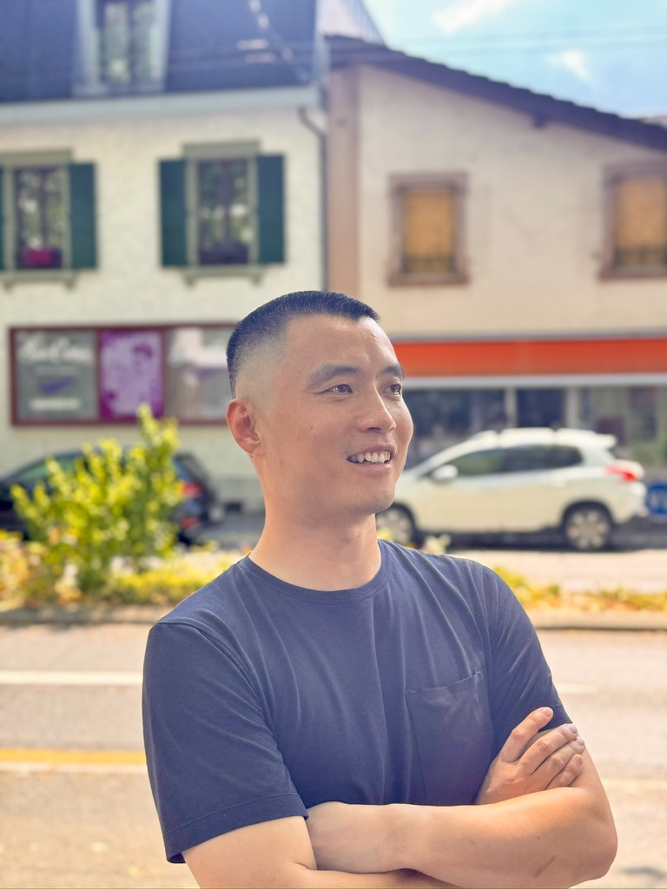

 

Hello! I'm **Yongyan Liu**, a first-year Master's student in Biostatistics at Columbia University. When I'm not analyzing data, you'll find me on mountains, underwater, or on the golf course.

 

### Adventures & Hobbies

**Skiing & Snowboarding** - Semi-Professional

I've been chasing powder since 2010, and it's become more than just a hobby. I've carved turns across four continents—from the resorts of Asia to the peaks of Europe, the Andes of South America, and the legendary slopes of North America. Whether it's fresh powder or groomed runs, I'm equally comfortable on skis or a snowboard.

 

**Scuba Diving** - Advanced Open Water Diver

With over 200 dives under my belt and a PADI Advanced Open Water license, I've explored underwater worlds that most people only see in documentaries. There's something magical about the weightlessness and tranquility beneath the surface—it's meditation in motion.

 

**Golf** - Enthusiastic Beginner

Currently playing at a 20 handicap and working to bring it down. Golf teaches patience and humility in ways that no other sport can. Every round is a new challenge, and I'm hooked.

 

### Key Data Analysis Projects

*   **[NYC MTA Data Analysis](https://nycmta.github.io/)**: A comprehensive analysis of the New York City subway system.
*   **[EVDx](https://github.com/liuyongyan/EVDx)**: An AI-powered diagnostic framework leveraging a large-scale, harmonized database of Extracellular Vesicle (EV) omics data (proteomics and miRNA) from human blood to identify disease biomarkers.

 

### Academic Life

**Columbia University** - Mailman School of Public Health |
Master of Science in Biostatistics | Expected 2027

Applying data science and statistical methods to solve real-world problems in public health.

[Download Resume](resumes/Yongyan_Liu_Resume.pdf)

 

### Get in Touch

Feel free to reach out via [email](mailto:yl6107@columbia.edu) or connect with me on [GitHub](https://github.com/liuyongyan). Always happy to chat about data, mountains, diving spots, or the best courses to play!
